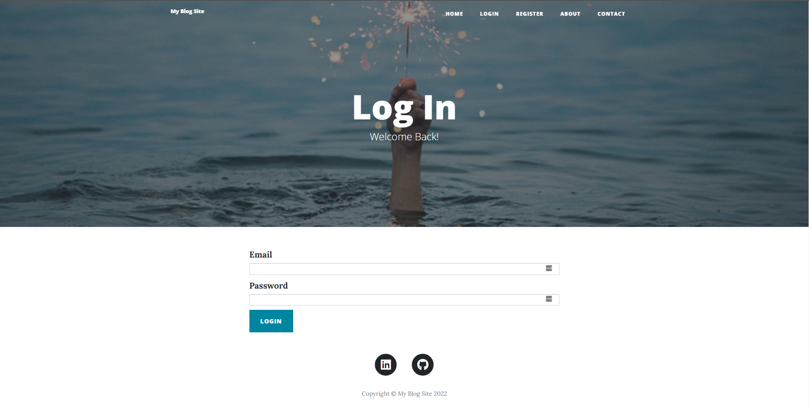
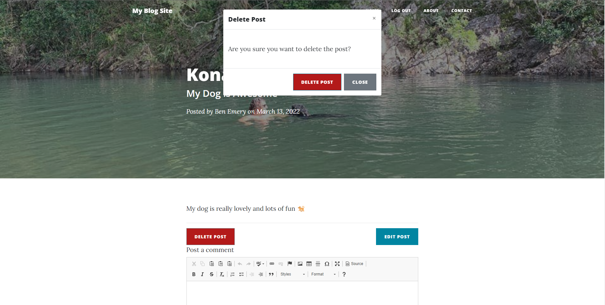
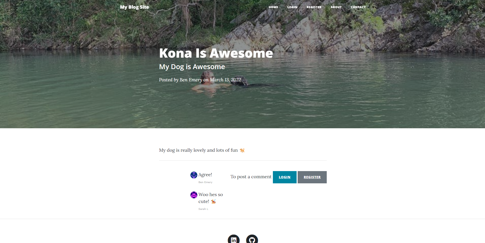

# Python Flask Blog Web App

Blog Web Application developed for 100 days of code on Udemey. 

At the time of writing, the app has been delployed on [Heroku here](https://ben-blog-app.herokuapp.com/). Developed using Flask and Bootstap. The html/css/bootstrap structure is sourced from [Start Bootstrap - Clean Blog template](https://startbootstrap.com/previews/clean-blog).

Functionality Overview:
* Users can register or login
* Non registered/logged in users can view the sites contents.
* Logged in users can create, edit and delete their blog posts.
* Logged in users can post comments on other posts.
* Users can submit a contact form
* Users passwords are hashed
* Users data, posts and comments are stored in a relational database.

Screenshots:
* Index page - Non logged in user

</img>

* Login page

</img>

* Register page

</img>

* Index page - Logged in user

</img>

* Logged in - creator delete post

</img>

* Logged in creator - Blog post

</img>

* Logged in edit post

</img>

* Not logged in blog post

</img>

* Logged in - not creator - Index

</img>

* Logged in - other user - blog post

</img>
